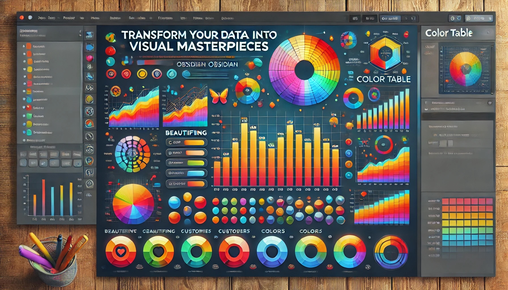

[English](README.md) | [简体中文](README_zh_CN.md) | [繁體中文](README_zh_TW.md) | [日本語](README_ja.md) | [Deutsch](README_de.md)


# **Color Table プラグイン**: Obsidianで美しい表を簡単に作成

**Color Table プラグイン**でObsidianの体験を変革しましょう。複雑なMarkdownの表構文をマスターする必要なく、生データを美しくフォーマットされた表や魅力的なチャートに変換するための最適なツールです。

## 🎧 **プラグイン紹介**

Color Tableプラグインのエキサイティングな機能についてもっと知るには、AI音声レビューをお聴きください：

<audio controls>
  <source src="media/color-table-review.m4a" type="audio/mp4">
  Your browser does not support the audio element.
</audio>


## 🌟 **主な機能**

- 🎨 **表を美しく**: 生データを洗練された読みやすい表に素早く変換します。
- 🌈 **色でカスタマイズ**: 表に鮮やかな色のテーマを使用して、あなたのスタイルを表現します。
- 📊 **トレンドを可視化**: データを目を引く棒グラフや円グラフ、折れ線グラフ、レーダーチャートなどのチャートタイプに簡単に変換し、素早く洞察を得られます。
- ✨ **インタラクティブ機能**: チャートのズームやパン、データポイントにホバーして詳細情報を表示、インタラクティブな表のソート機能でデータをより深く理解できます。

## 🚀 **はじめ方**

1. **Obsidian**を開き、**設定**に移動します。
2. **コミュニティプラグイン**セクションに進みます。
3. **セーフモード**を無効にします。
4. **閲覧**をクリックし、**Color Table**を検索します。
5. 表とチャートのコンパニオンをインストールして有効にしましょう！

## 💡 **使用方法**

### **シンプルなMarkdownで表を作成**

Markdownファイル内の任意のプレーンテキストデータを選択し、**「Markdownテーブルに変換」**コマンドを使用します。プラグインが自動的にデータをクリーンで整理された表に変換します。複雑なフォーマットを心配する必要はありません。データ形式が正しくない場合は、役立つ通知が表示されます。

**ヒント**: ホットキーを使用して変換プロセスを高速化しましょう！最良の結果を得るために、データ値をカンマ(`,`)で区切ることを忘れずに。


### **魅力的でカスタマイズ可能な表を作成**

Markdownファイルで、以下の形式を使用して視覚的に魅力的な表を生成します：

````markdown
```csv-table orange
ID, Name, Age, Department, Salary
1, Alice, 29, HR, 50000
2, Bob, 35, IT, 75000
...
12, Liam, 45, Finance, 82000
```
````


#### **インタラクティブな表：データをさらに活用**

ソート可能な列などの動的機能で表を強化し、以下のことができます：

- 🖱️ **即時ソート**：任意の列ヘッダーをクリックしてデータをソートします。
- 🔄 **ソート方向の切り替え**：昇順と降順を簡単に切り替えられます。
- ⚡ **リアルタイム更新**：データが即座に再ソートされるのを見て、素早い判断を助けます。


### **複数のチャートタイプでインタラクティブなチャートを作成**

棒グラフ、円グラフ、折れ線グラフ、またはレーダーチャートでデータを可視化したいですか？簡単です！このフォーマットを使用して、表を即座にチャートに変換できます：

````markdown
```csv-chart red bar
Month, Sales
Jan, 1200
Feb, 200
...
Dec, 1900
```

```csv-chart blue pie
Category, Percentage
A, 30
B, 25
C, 45
```

```csv-chart green line
Date, Revenue
2021-01-01, 500
2021-02-01, 750
2021-03-01, 900
```
````


#### **インタラクティブなチャート機能**

- 🔍 **ズームとパン**: 特定の領域にズームインしたり、大規模なデータセットをパンしたりしてデータを探索できます。
- 🎯 **ホバー詳細**: チャート上の各データポイントにカーソルを合わせると、詳細情報を取得できます。

### **カラーテーマでスタイルを選択**

Obsidianの美学に合わせて、さまざまなカラーテーマで表やチャートをパーソナライズできます：

- orange
- blue
- green
- red
- purple
- gray
- pink
- yellow
