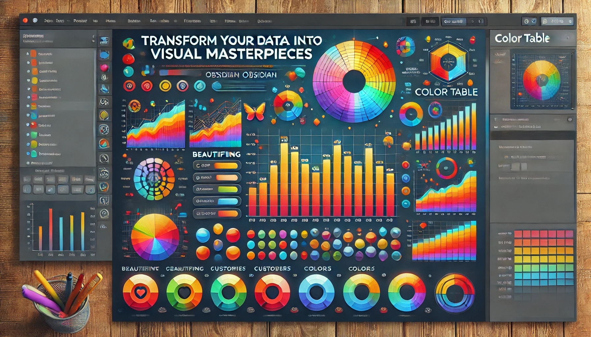

[English](README.md) | [简体中文](README_zh_CN.md) | [繁體中文](README_zh_TW.md) | [日本語](README_ja.md) | [Deutsch](README_de.md)

# **彩色表格插件**：將您的數據轉化為視覺傑作

使用**彩色表格插件**來提升您的 Obsidian 體驗——這是您將普通 CSV 數據轉換為美觀格式化表格和引人注目圖表的終極工具。

## 🎧 **插件介紹**

聆聽 AI 音頻評論，了解更多關於彩色表格插件的精彩功能：

<audio controls>
  <source src="media/color-table-review.m4a" type="audio/mp4">
  Your browser does not support the audio element.
</audio>


## 🌟 **主要特點**

- 🎨 **美化您的數據**：為 CSV 文件注入生命力，呈現視覺吸引力的表格。
- 🌈 **以色彩定制**：通過一系列鮮豔的色彩主題表達您的風格。
- 📊 **可視化趨勢**：將您的數據轉換為引人注目的條形圖，以便快速分析。

## 🚀 **開始使用**

1. 打開 **Obsidian** 並導航至**設置**。
2. 前往**社區插件**部分。
3. 停用**安全模式**。
4. 點擊**瀏覽**，然後搜索 **Color Table**。
5. 安裝並啟用您的數據可視化助手！

## 💡 **如何使用**

### **將 CSV 轉換為 Markdown 表格**

在您的 Markdown 文件中選擇任何 CSV 格式的文本，並使用**"將 CSV 轉換為 Markdown 表格"**命令。如果文本是有效的 CSV，它將立即轉換為整潔的 Markdown 表格。否則，將出現無效格式的通知。

**提示**：將此功能與快捷鍵結合使用，實現快速的 CSV 到 Markdown 轉換！


### **創建令人驚嘆的表格**

在您的 Markdown 文件中，只需使用以下格式即可生成美觀的樣式表格：

````markdown
```csv orange
ID, Name, Age, Department, Salary
1, Alice, 29, HR, 50000
2, Bob, 35, IT, 75000
...
12, Liam, 45, Finance, 82000
```
````


#### **互動式排序：釋放您數據的力量**

通過動態可排序的列來提升您的表格。只需一次點擊，您就可以：

- 🖱️ **即時排序**：點擊任何列標題來對您的數據進行排序。
- 🔄 **切換方向**：輕鬆在升序和降序之間切換。
- ⚡ **實時更新**：觀察您的數據如何立即重新排序，提供即時洞察。

利用這個直觀的功能來增強您的決策能力！


### **創建條形圖**

想要將您的數據可視化為條形圖嗎？使用以下格式：

````markdown
```csv-chart red
Month, Sales
Jan, 1200
Feb, 200
...
Dec, 1900
```
````


### **顏色主題**

從多種顏色主題中選擇以匹配您的風格：

- orange
- blue
- green
- red
- purple
- gray
- pink
- yellow

